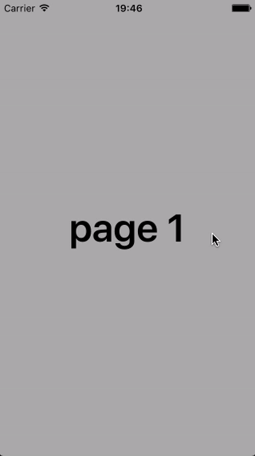

# MagazineViewController

A simple paging view controller, with an interactive gesture, that mimics a magazine paging effect.



## Installation

To install `MagazineViewController`, add the following line to your Podfile:

```ruby
pod 'MagazineViewController', :git => 'https://github.com/macoscope/MagazineViewController.git'
```

## Author

[Macoscope](http://www.macoscope.com), [info@macoscope.com](info@macoscope.com)

## License

MagazineViewController is available under the MIT license. See the LICENSE file for more info.
